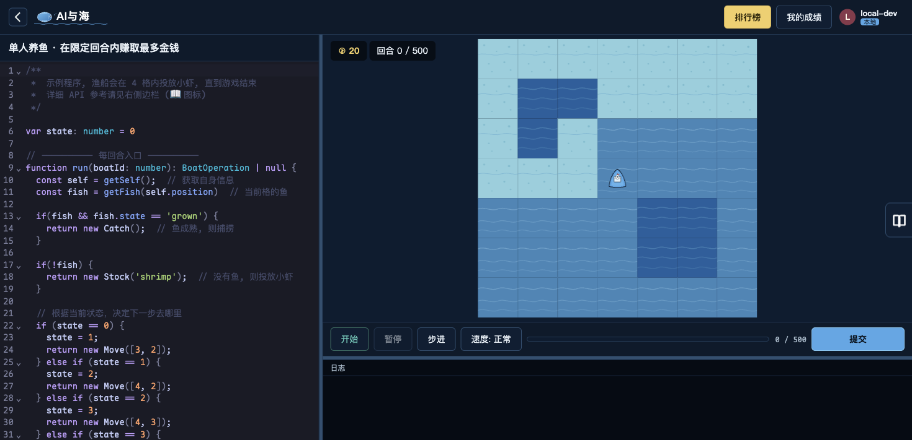

# AI and the Sea

**English** | [简体中文](README.zh-CN.md)

Current version: **2.0.0**

AI and the Sea is a turn-based ocean farming game built around player-authored programs. Players write TypeScript strategies to control fishing boats, stock fish, feed them, harvest them, and optimize an ocean economy within a fixed map and turn limit.

<p align="center">
  
</p>

<p align="center"><em>Write the strategy on the left and watch the fishing boat execute it on the ocean map.</em></p>

## Core gameplay

### Solo farming

- Start with one fishing boat on a fixed map and maximize earnings over 500 turns.
- Water type, position, fish species, feed, and travel routes all affect the strategy.
- Programs run locally in the browser and are safely re-executed by the backend when submitted to the leaderboard.

### Competitive play

- Both players start with two boats on a symmetric map.
- Manage your own waters, enter the opponent's territory, take fish, disrupt their layout, or intercept intruders.
- The 14×7 map is mirrored so both players program as if their own half were on the left.
- The server advances each turn and streams match events over WebSocket.

## Highlights

- Player code is compiled by `esbuild-wasm` into one consistent IIFE format.
- The frontend Web Worker and backend `worker_threads + vm` sandbox share the same execution model.
- Water tiles, fish, and boat operations are registry-driven extensions instead of engine-level conditionals.
- Replay files retain the random seed, allowing matches to be reproduced deterministically.
- Local development automatically uses the `local-dev` identity when GitHub OAuth is not configured.

## Requirements

- Node.js 24 or later.
- npm 10 or later.

## One-click launch on macOS

Double-click the following file in the repository root:

```text
一键启动.command
```

The launcher checks the environment, installs missing dependencies, builds the latest source, selects an available port, and opens the game in the browser. Keep its Terminal window open and press `Control+C` to stop the service.

## Run from source

```bash
npm install
```

Run the following commands in three separate terminals:

```bash
npm run dev:shared
npm run dev:backend
npm run dev:frontend
```

Open [http://localhost:5173](http://localhost:5173).

## Build and package

```bash
npm run build
npm run package
```

Docker:

```bash
docker build -t aiyu:2.0.0 .
docker run -d -p 3001:3001 -v aiyu-data:/data aiyu:2.0.0
```

## Tests and checks

```bash
npm test
npm run typecheck
```

The test suite covers engine semantics, mirrored coordinates, player-code compilation, turn orchestration, deterministic replays, and backend sandbox behavior.

## Project structure

```text
ai-and-the-sea/
├── packages/
│   ├── shared/      # Game engine, player API, compiler, and replay logic
│   ├── backend/     # Express, SQLite, WebSocket, and secure validation
│   └── frontend/    # Vite, CodeMirror 6, Canvas, and Web Worker execution
├── scripts/             # Build, packaging, and sandbox verification tools
├── Dockerfile
└── 一键启动.command
```

## Player program constraints

- Programs must define `function run(droneId: number): DroneOperation`.
- `run()` is called once per boat on every turn, with a 400ms limit per call.
- Network, system, and asynchronous APIs are blocked inside the sandbox.
- `esbuild` strips TypeScript annotations but does not type-check player programs during compilation.

## Local data

- The one-click launcher stores SQLite data at `packages/backend/data.db` by default.
- Databases, `.env` files, dependencies, and build outputs are excluded from GitHub.
- To enable GitHub OAuth, use `packages/backend/.env.example` as the local configuration reference.

## Troubleshooting

- If the launcher reports an old Node.js version, upgrade to Node.js 24 or later.
- If port 3001 is occupied, the one-click launcher automatically tries subsequent ports.
- The backend may print an `ExperimentalWarning` for Node's built-in `node:sqlite`; it can be ignored.
- Without GitHub OAuth configuration, the local application signs in automatically as `local-dev`.
